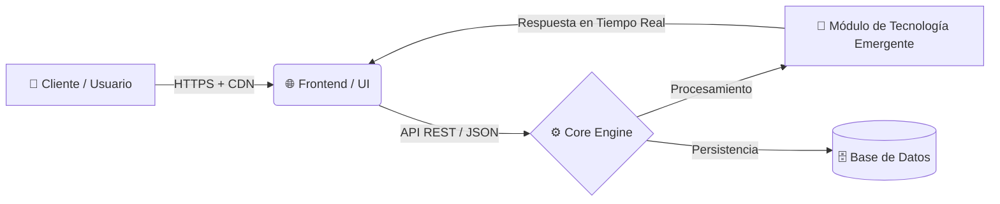

<div align="center">

  <!-- BANNER / TÍTULO PRINCIPAL -->
  <h1>⚡ [NOMBRE DEL PROYECTO] ⚡</h1>
  <p><b>Innovación disruptiva impulsada por Tecnologías Emergentes</b></p>

  <!-- BADGES / INSIGNIAS -->
  <p>
    
    
    
    
  </p>

  <h3>
    🌐 <a href="https://tu-subdominio.tudominio.com">Ver Demo en Vivo</a> &nbsp;·&nbsp; 
    📖 <a href="#-arquitectura-del-sistema">Arquitectura</a> &nbsp;·&nbsp; 
    🚀 <a href="#-instalación-y-despliegue">Instalación</a>
  </h3>

</div>

---

## 🎯 El Reto (Problemática)

> *"Una breve frase de impacto sobre el problema real que están resolviendo en este HackaTec 2026."*

En la actualidad, **[mencionar sector o industria]** enfrenta cuellos de botella críticos debido a procesos manuales, falta de trazabilidad y latencia en la toma de decisiones. Esto genera pérdidas de eficiencia y limita la escalabilidad tecnológica.

---

## 💡 Nuestra Solución

**[NOMBRE DEL PROYECTO]** es una plataforma de próxima generación desarrollada durante el **HackaTec 2026** dentro de la vertical de **Tecnologías Emergentes**. Integra automatización inteligente, procesamiento en tiempo real y una interfaz centrada en la velocidad para transformar la manera en que **[describir qué logra el usuario final]**.

### ✨ Características Principales (Key Features)

* 🧠 **Procesamiento Inteligente:** Algoritmos optimizados para análisis y respuesta en tiempo real.
* ⚡ **Ultra Baja Latencia:** Infraestructura acelerada por CDN y compresión dinámica para tiempos de carga menores a 1 segundo.
* 📱 **Diseño Mobile-First & Responsivo:** Interfaz fluida adaptable a cualquier dispositivo en campo o escritorio.
* 🔒 **Seguridad y Escalabilidad:** Arquitectura modular lista para entornos de producción bajo protocolo HTTPS/SSL.

---

## 🏗️ Arquitectura del Sistema

*(GitHub renderiza este diagrama automáticamente)*



---

## 🛠️ Stack Tecnológico

<div align="center">

| Capa | Tecnologías Implementadas |
| :--- | :--- |
| **Frontend & UI** |    |
| **Backend & Core** |    |
| **Base de Datos** |  |
| **Infraestructura & DevOps** |     |

</div>

*(Nota: Borra de la tabla los íconos de los lenguajes que no vayas a usar en el proyecto final).*

---

## 🚀 Instalación y Despliegue Local

Sigue estos pasos para ejecutar el entorno de desarrollo en tu máquina local:

1. **Clonar el repositorio:**
   ```bash
   git clone [https://github.com/TU_USUARIO/TU_REPOSITORIO.git](https://github.com/TU_USUARIO/TU_REPOSITORIO.git)
   cd TU_REPOSITORIO
   ```

2. **Configurar variables de entorno:**
   Renombra el archivo `.env.example` a `.env` y coloca tus credenciales locales.

3. **Ejecutar el proyecto:**
   Abre `index.html` en tu navegador o levanta el servidor local de desarrollo.

---

## 📊 Impacto y Métricas Esperadas

* **Reducción de tiempos operativos:** Hasta un **70%** frente a métodos tradicionales.
* **Accesibilidad 24/7:** Desplegado en la nube con alta disponibilidad.
* **Escalabilidad:** Capaz de integrarse con APIs externas, sensores IoT o modelos de IA mediante webhooks.

---

## 👨‍💻 Equipo de Desarrollo

Proyecto desarrollado con orgullo para el **HackaTec Nacional / Regional 2026**:

* **[Tu Nombre / Rol]** - *Full-Stack & Arquitectura* - [@tu_usuario_github](https://github.com/tu_usuario)
* **[Integrante 2]** - *Backend & Datos*
* **[Integrante 3]** - *UI/UX & Frontend*
* **[Integrante 4]** - *Investigación & Pitch*

---

<div align="center">
  <sub>By CodeTEC - <b>HackaTec 2026 — Tecnologías Emergentes</b>.</sub>
</div>